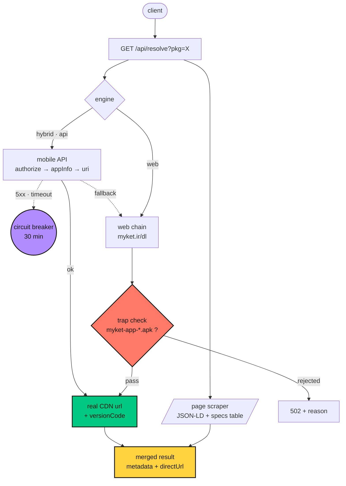

<div align="center">

<a href="https://myket-dl.mmdbots.workers.dev/">
  
</a>

<br>

<a href="https://git.io/typing-svg">
  
</a>

### دانلود مستقیم APK برنامه‌های رایگان مایکت — با مشخصات کامل هر برنامه

<p>
  <a href="https://myket-dl.mmdbots.workers.dev/">
    
  </a>
</p>

<p>
  
  
  
  
</p>

<p>
  <a href="#-معماری">🏗️ معماری</a> &nbsp;·&nbsp;
  <a href="#-api">📡 API</a> &nbsp;·&nbsp;
  <a href="#-%D8%A7%D8%B3%D8%AA%D9%82%D8%B1%D8%A7%D8%B1-%D8%AF%D8%B1-%DB%B6%DB%B0-%D8%AB%D8%A7%D9%86%DB%8C%D9%87">🚀 استقرار</a> &nbsp;·&nbsp;
  <a href="https://myket-dl.mmdbots.workers.dev/api/debug?pkg=com.digikala">🩺 دیباگ زنده</a>
</p>

</div>

---

## 🏗️ معماری



مشخصات برنامه (توضیحات، اسکرین‌شات، امتیاز، چنج‌لاگ، توزیع ستاره‌ها و برنامه‌های
مشابه) از صفحه‌ی عمومی خونده می‌شه و با لینک دانلود توی یک پاسخ ادغام می‌شه.

> [!CAUTION]
> مسیر `/dl` بیشتر مواقع به‌جای فایل برنامه، APK فروشگاه خود مایکت رو با اسم
> جعلی می‌فرسته. اینجا اون فایل با پترن تشخیص داده و رد می‌شه — دریافتش یعنی
> کاربر یه فایل کاملاً اشتباه نصب می‌کنه.

## ✨ امکانات

<table>
  <tr>
    <td width="50%">
      <h3>🧠 موتور هیبرید</h3>
      اولویت با API رسمی مایکت و fallback خودکار روی وب — روی هر نتیجه مشخصه لینک از کدوم موتور اومده.
    </td>
    <td width="50%">
      <h3>🕵️ تشخیص تله</h3>
      فایل جعلی <code>myket-app</code> که با اسم برنامه میاد، شناسایی و رد می‌شه. هیچ‌وقت به کاربر نمی‌رسه.
    </td>
  </tr>
  <tr>
    <td width="50%">
      <h3>📊 مشخصات کامل</h3>
      امتیاز، حجم، نسخه، چنج‌لاگ، گالری اسکرین‌شات، نمودار توزیع ستاره‌ها و برنامه‌های مشابه.
    </td>
    <td width="50%">
      <h3>🌙 دارک‌مود + تم رنگی</h3>
      شب/روز و ۵ رنگ اصلی (سبز، بنفش، نارنجی، آبی، صورتی) — ذخیره توی <code>localStorage</code> بدون فلش.
    </td>
  </tr>
  <tr>
    <td width="50%">
      <h3>🔗 اشتراک نتیجه</h3>
      هر نتیجه با <code>?p=</code> لینک مستقیم داره. اسم بسته یا لینک صفحه‌ی مایکت — هر دو قبوله.
    </td>
    <td width="50%">
      <h3>🧪 کنسول تست داخلی</h3>
      اندپوینت‌ها رو از همون صفحه تست کن + دکمه‌ی «عیب‌یابی» که می‌گه کدوم مرحله گیر کرده.
    </td>
  </tr>
</table>

## 📡 API

| متد | مسیر | چکار می‌کنه |
|:---:|---|---|
|  | `/api/resolve?pkg=X` | مشخصات کامل + لینک دانلود |
|  | `/api/download?pkg=X` | استریم خود فایل APK با اسم درست |
|  | `/api/debug?pkg=X` | گزارش مرحله‌به‌مرحله برای عیب‌یابی |
|  | `/healthz` | سلامت سرویس |

> [!TIP]
> به‌جای `X` لینک صفحه‌ی برنامه هم قبوله؛ اسم بسته خودش در میاد. پارامترها:
> `engine=api|web|hybrid` (پیش‌فرض hybrid) و `force=1` برای دور زدن circuit breaker.
> فقط برنامه‌های رایگان — برنامه‌ی پولی با کد `PAID` برمی‌گرده.

<details>
<summary><b>نمونه‌ی پاسخ <code>/api/resolve</code></b> (کلیک کن)</summary>

```json
{
  "ok": true,
  "engine": "api",
  "packageName": "com.digikala",
  "title": "دیجی‌کالا",
  "versionCode": "1002003",
  "directUrl": "https://cdn2.myket.ir/apps/.../app.apk",
  "proxyUrl": "/api/download?pkg=com.digikala&engine=api",
  "fileName": "com.digikala-v1002003.apk",
  "rating": { "value": 4.3, "count": 95127, "best": 5 },
  "installsText": "+۱۰,۰۰۰,۰۰۰",
  "screenshots": ["https://cdn2.myket.ir/asset-files/screenshots/..."]
}
```

</details>

## 🚀 استقرار در ۶۰ ثانیه

**از داشبورد (بدون ابزار):** یه Worker بساز، محتوای `worker.js` رو جایگذاری کن،
Deploy بزن. همین.

**با wrangler:**

```bash
git clone https://github.com/USER/myket-dl.git && cd myket-dl
npm install -g wrangler && wrangler login
wrangler deploy
```

`wrangler.toml` آماده‌ست — اسم ورکر روشه و با `workers_dev = true` دامنه‌ی
رایگان `workers.dev` می‌گیری.

## 🎨 رابط کاربری

- 🧭 استپر مرحله‌به‌مرحله + اسکلت لودینگ
- 🖼️ گالری اسکرین‌شات با درگ و لایت‌باکس
- 📊 نمودار توزیع امتیاز با انیمیشن
- 🩺 پنل عیب‌یابی زنده (صفحه ← auth ← ساخت لینک ← fallback)

## 🗺️ رودمپ

- [x] موتور هیبرید (API + fallback وب)
- [x] تشخیص تله‌ی myket-app
- [x] دارک‌مود + تم رنگی
- [ ] کش edge با Workers KV
- [ ] QR دانلود برای گوشی
- [ ] پیشنهادت چیه؟ ایشو باز کن

## 📄 لایسنس

هر استفاده‌ای می‌خوای بکن. مسئولیت نحوه‌ی استفاده با خودته.

<div align="center">
  <br>
  <sub>اگه بدردت خورد، یه ⭐ به ریپو بزن</sub>
  <br><br>
  
</div>
